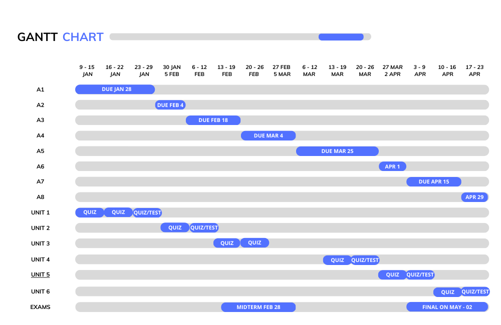

# CSE 446

<h2>CSE 446 Gannt chart</h2>

## Modules 
* [Assignments](https://github.com/berrios96sean/CSE-446-/tree/main/Assignments) 
* [Unit One](https://github.com/berrios96sean/CSE-446-/tree/main/Unit_One) 

## Assignments 
* [Assignment One](https://github.com/berrios96sean/CSE-446-/tree/main/Unit_One/A_One_Berrios_Sean) 

## All Lecture Notes
* [Lecture One](https://github.com/berrios96sean/CSE-446-/blob/main/Unit_One/1_1_Notes.txt) 
* [Lecture Two](https://github.com/berrios96sean/CSE-446-/blob/main/Unit_One/1_2_Notes.txt) 
