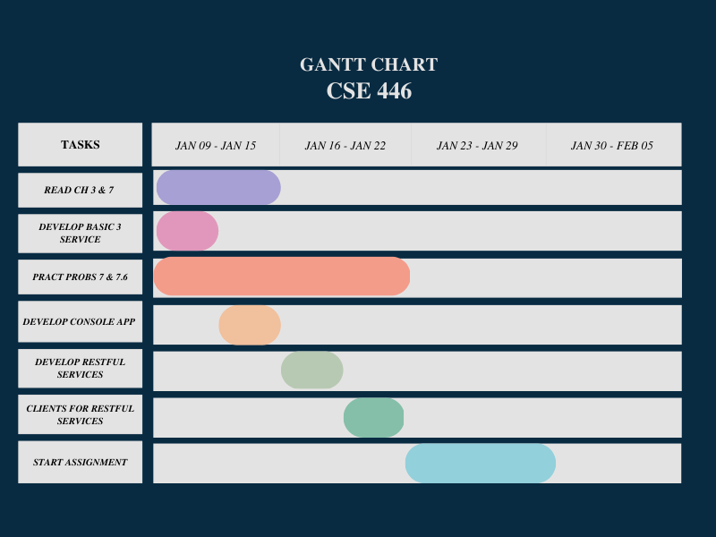

# Unit One 

#### Tasks 
* Academic Integrity agreement Due Monday Jan. 9th 
* Read Text Sections 1.4, 1.5, 7.1, 7.2, 7.3 
* Do multiple chose exercises at end of each section 

### Assignment One 
* Due Date: Jan 29 
<h2>Due Date</h2>

#### Preparation 
* Read Textbook chapter 3 and 7 
* Chapter 3 will have instructions on how to develop a basic three service 
* Test project on another machine to ensure that it runs 
* Solve practice problems in Chapter 7 and 7.6 multiple choice to prepare for quizzes and exam 
* Follow text section 7.1.1 and repeat the development process of the console app 
* Follow text sections 7.3.3 and 7.3.4 and repeat development process of the RESTful services 
* Follow the text sections 7.3.5 and repeat the development process of the clients that consume the RESTful service 

#### Assignment Description and TO DOS: 
* Create a number guessing game using WCF Services and displaying the game in a GUI on a IIS Server 
* PDF mentions reviewing section 3.2 of the textbook before completing the assignment 
